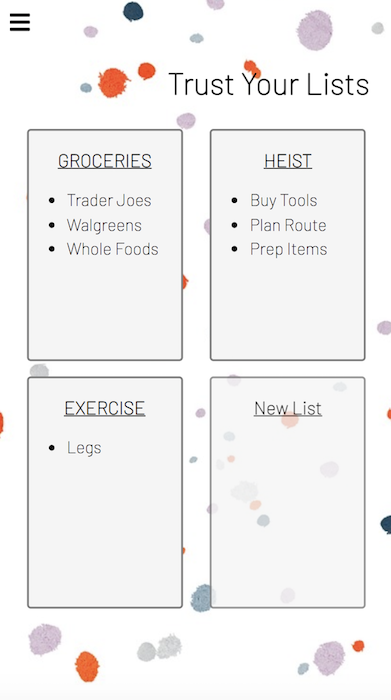

# README

Welcome to TrustyList, trust us to secure your lists!

Are you forgetting your todos? Can't separate work tasks from personal tasks? If this sounds like you, this is the app for you. Our registered users get to keep separate lists for all aspects of your life - all you need is a valid email! You can add titled tasks to your lists to keep track. These tasks can hold detailed descriptions and notes/comments; (duedates soon to be added). Finish a task and check it off, think of all you can accomplish!

To get started, download/clone TrustyList to your local system and enter:
* <code>npm install</code>
* <code>npm run build</code> 
* <code>rails server</code>

Navigate on your web browser to localhost:3000 and you should be ready to get started!

Layout Scales for Mobile Viewing: 

Technologies Used: 
* Rails: 5.2.4.5
* PostgreSQL: 12.4
* Node: 14.15.0
* react: 17.0.2
* react-redux: 7.2.3
* webpack: 5.28.0

* HTML5
* JavaScript
* Ruby
* CSS

